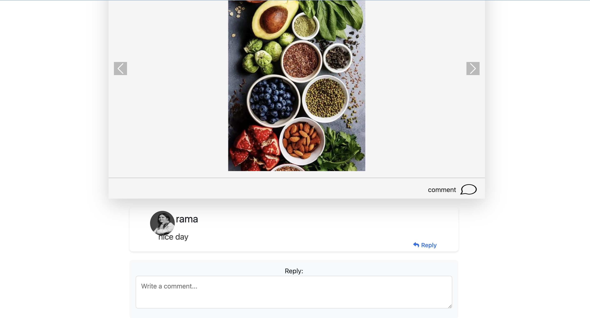
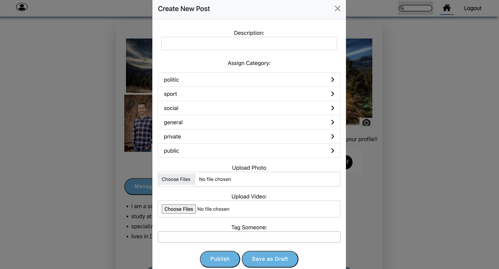

# Social Media Web Application (Laravel + Blade)

## 📌 Project Overview
A full-stack social media web application inspired by Facebook, built with **Laravel** (backend) and **Blade** (frontend) using **HTML, CSS, JavaScript, and AJAX** for a smooth single-page-like experience.  
It provides a feature-rich platform for users to connect, share posts, comment, and manage profiles, while admins have full control over categories, analytics, and system management.

---

## 🚀 Features

### 👤 User Features
- **Authentication & Registration** with email verification and Two-Factor Authentication (2FA).
- **Profile Management**: Upload/change profile and cover photos, manage descriptions, and switch privacy settings.
- **Posts Management**: Create, update, delete, archive, filter, and publish posts with **media upload restrictions** (photos/videos per post).
- **Comments System**: Nested comments, replies, update/delete comments, and view comment threads.
- **Search**: Search across users, posts, photos, videos, and categories with **load more** pagination.
- **Multilingual Support**: Arabic and English toggle option.
- **Blade Views** styled with CSS, JS, and AJAX for a responsive experience.

### 🔐 Admin Features
- **Admin Authentication**: Secure login, registration, and logout with middleware checks.
- **Category Management**: Add, update, delete, search, paginate, and manage nested categories.
- **Analytics Dashboard**: Track key system metrics for admins.
- **Two-Factor Authentication** for admin actions.
- **Role & Permission Management** using **Spatie** for admin/user separation.
- Admin operations hidden from normal users while using the same dashboard views.

### ⚙️ System & Backend
- **Architecture**: MVC pattern with **Service Layer** for logic and **Repository Layer** for DB handling.
- **Database**: MySQL with migrations, seeders, and soft deletes.
- **Caching**: Redis for faster performance.
- **Validation**: Centralized validation with traits and custom exception handling.
- **Mailing**: Email notifications for authentication & 2FA codes.
- **Authentication**: Laravel Passport (API) and web guard.
- **Security**: Middleware for authentication, roles, and two-factor checks.

---

## 🛠️ Tech Stack
- **Backend**: Laravel (PHP)
- **Frontend**: Blade, HTML, CSS, JavaScript, AJAX
- **Database**: MySQL
- **Caching**: Redis
- **Auth**: Laravel Passport, Middleware, 2FA
- **Roles & Permissions**: Spatie
- **Email**: Laravel Mail
- **Architecture**: MVC + Service + Repository

---

## 📂 Project Structure
- `app/Http/Controllers/Admin` → Web & API controllers for Admin panel.
- `app/Http/Controllers/User` → Web & API controllers for User features.
- `app/Services` → Business logic services.
- `app/Repositories` → Database queries and repository pattern.
- `resources/views` → Blade templates (HTML, CSS, JS, AJAX).
- `routes/web.php` → Web routes for both Admin and User.
- `routes/api.php` → API routes for mobile/third-party clients.

---


## 📸 Screenshots

### Home Feed


### User Profile


### Post Creation



## ⚡ Installation & Setup

1. **Clone the repository**
   ```bash
   git clone https://github.com/your-username/social-media-app.git
   cd social-media-app
   ```

2. **Install dependencies**
   ```bash
   composer install
   npm install && npm run dev
   ```

3. **Environment setup**
   ```bash
   cp .env.example .env
   php artisan key:generate
   ```
   Update `.env` with your database, Redis, and mail credentials.

4. **Run migrations & seeders**
   ```bash
   php artisan migrate --seed
   ```

5. **Storage link (for profile & media images)**
   ```bash
   php artisan storage:link
   ```

6. **Run scheduler & queue workers (for emails, jobs, background tasks)**
   ```bash
   php artisan schedule:work
   php artisan queue:work
   ```

7. **Serve the application**
   ```bash
   php artisan serve
   ```
8. **Import the provided Postman collection (postman/Psot Blog.postman_collection.json) into Postman.**

9. **Configure the environment variables in Postman to match your local setup.**

10. **You can now use the Postman collection to explore and test the API endpoints.**

---

## ✅ Example User Flows

- User registers → receives email → verifies → logs in with 2FA.  
- User creates a post with text + media → followers can comment/reply.  
- Admin manages categories, views analytics, and monitors users.  
- Posts, profiles, and comments respect privacy & media rules.

---

## 📖 API & Testing
- API secured with **Passport** tokens.  
- Postman collection can be imported for API testing.  
- Supports both Web (Blade) and API routes.  

---

## 📌 Summary for CV
Developed a **full-stack social media platform** (Laravel + Blade) with:  
- **Authentication & 2FA**, role-based access (Spatie).  
- **Posts, comments, and media handling** with validation & restrictions.  
- **Admin dashboard** for categories, analytics, and user management.  
- **MVC architecture with Service & Repository layers**.  
- **Caching with Redis, MySQL DB, and mailing system**.  
- **Frontend in Blade with AJAX for SPA-like experience**.  

---

## 👨‍💻 Author
**Zaid Kreshati**  
🚀 Full-Stack Developer | Laravel | PHP | MySQL | Redis | JavaScript
